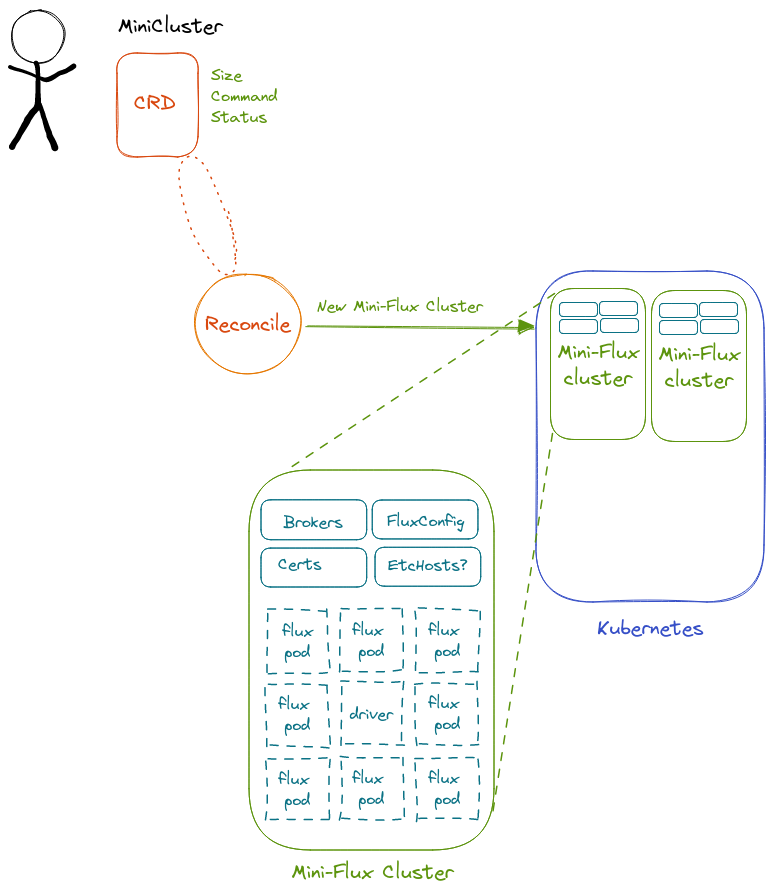

# Flux Operator



🚧️ Under Construction! 🚧️

This is currently a scaffolding that is having functionality added as @vsoch figures it out.
Come back and check later for updates! To work on this operator you should:

 - Have a recent version of Go installed (1.18.1)
 - Have minikube installed
  
The sections below will describe:

 - [Organization](#organization) and design
 - [Quick Start](#quick-start) for using the operator
 - [Using the Operator](#using-the-operator): in more detail, as it is provided here
 - [Making the Operator](#making-the-operator): steps to initially create the operator

## Organization

The basic idea is that we present the idea of a **MiniCluster** that is a custom resource definition (CRD)
that defines a job container (that must have flux) that (when submit) will create a set of config maps,
secrets (e.g., tls), and the final Batch job that has the pod containers running with flux. Since
this is a batchv1.Job, it will have states that we can track.

And you can find the following:

 - [Flux Controllers](controllers/flux) are under `controllers/flux` for the `MiniCluster`
 - [API Spec](api/v1alpha1/) are under `api/v1alpha1/` also for `MiniCluster`
 - [Packages](pkg) include supporting packages for job conditions (state), if we eventually want that.
 - [TODO.md](TODO.md) is a set of things to be worked on, if you'd like to contribute!
 - [Documentation](docs) is currently a place to document design, and eventually can be more user-facing docs.


## Quick Start

Know how this stuff works? Then here you go!

```bash
# Clone the source code
$ git clone https://github.com/flux-framework/flux-operator
$ cd flux-operator

# Start a minikube cluster
$ minikube start

# Make a flux operator namespace
$ kubectl create namespace flux-operator
namespace/flux-operator created

# Build the operator
$ make

# How to make your manifests
$ make manifests

# And install. This places an executable "bin/kustomize"
$ make install
```

There is also a courtesy function to clean, and apply the samples:

```bash
$ make clean  # remove old flux-operator namespaced items
$ make apply  # apply the setup and job config
$ make run    # make the cluster (e.g.., setting up the batch job)
```

or run all three for easy development! The below command ensures to submit a job after the FluxSetup is applied so it won't be ignored (jobs submit before there is a cluster setup are ignored and require the user to re-submit).

```bash
$ make redo  # clean, apply, and run
```
To see logs for the job, you'd do:

```bash
$ kubectl logs -n flux-operator job.batch/flux-sample
```

And this is also:

```bash
$ make log
```

## Using the Operator

If you aren't starting from scratch, then you can use the code here to see how things work!

```bash
$ git clone https://github.com/flux-framework/flux-operator
$ cd flux-operator
```

### 1. Start a Cluster

First, start a cluster with minikube:

```bash
$ minikube start
```

And make a flux operator namespace

```bash
$ kubectl create namespace flux-operator
namespace/flux-operator created
```

You can set this namespace to be the default (if you don't want to enter `-n flux-operator` for future commands:

```bash
$ kubectl config set-context --current --namespace=flux-operator
```

If you haven't ever installed minkube, you can see [install instructions here](https://minikube.sigs.k8s.io/docs/start/).

### 2. Build

And then officially build.

```bash
$ make
```

To make your manifests:

```bash
$ make manifests
```

And install. Note that this places an executable [bin/kustomize](bin/kustomize) that you'll need to delete first if you make install again.

```bash
$ make install
```

### 3. Cleanup

When cleaning up, you can control+c to kill the operator from running, and then:

```bash
$ make clean
```

And then:

```bash
$ minikube stop
```

## Making the operator

This section will walk through some of the steps that @vsoch took to create the controller using the operator-sdk, and challenges she faced.

### 1. Installation

First, [install the operator-sdk](https://sdk.operatorframework.io/docs/installation/) for your platform.
At the end of this procedure it should be on your path.
At the

```bash
$ which operator-sdk
/usr/local/bin/operator-sdk
```

### 2. Start A Development Cluster

You can either use [minikube](https://minikube.sigs.k8s.io/docs/start/):

```bash
$ minikube start

# or for the first time
$ minikube start init
```

### 3. Local Workspace

At this point, I made sure I was in this present working directory, and I created
a new (v2) module and then "init" the operator:

```bash
$ go mod init flux-framework/flux-operator
$ operator-sdk init
```

Note that you don't need to do this, obviously, if you are using the existing operator here!

### 4. Create Controller

Now let's create a controller, and call it Flux (again, no need to do this if you are using the one here).

```bash
$ operator-sdk create api --version=v1alpha1 --kind=MiniCluster
```
(say yes to create a resource and controller). Make sure to install all dependencies (I think this might not be necessary - I saw it happen when I ran the previous command).

```bash
$ go mod tidy
$ go mod vendor
```

**under development**

And then see the instructions above for [using the operator](#using-the-operator).

### 5. Debugging Yaml

Since many configs are created in the operator, I always write them out in yaml to the [yaml](yaml)
directory. We can remove these bits of the code after we are done. I also found the following debugging commands useful:

```bash
# Why didn't my statefulset create?
kubectl describe -n flux-operator statefulset
```

## Useful Resources

I found the following resources really useful:

 - [RedHat OpenShift API Spec](https://docs.openshift.com/container-platform/3.11/rest_api/objects/index.html#objectmeta-meta-v1) for digging into layers of objects
 - [Kubernetes API](https://github.com/kubernetes/api/blob/2f9e58849198f8675bc0928c69acf7e50af77551/apps/v1/types.go): top level folders apps/core/batch useful!

## Troubleshooting

To view a resource (in the flux-operator namespace):

```bash
$ kubectl --namespace flux-operator get pods
```

I found this helpful for debugging the stateful set - e.g., it was stuck on ContainerCreating:

```bash
$ kubectl describe -n flux-operator pods
```

If you need to clean things up (ensuring you only have this one pod and service running first) I've found it easier to do:

```bash
$ kubectl delete pod --all

# Service shorthand
$ kubectl delete svc --all
$ kubectl delete statefulset --all

# ConfigMap shorthand
$ kubectl delete cm --all
```

One time I messed something up and my metrics server was still running (and I couldn't start again) and I killed it like this:

```bash
$ kill $(lsof -t -i:8080)
```

If you see:

```bash
1.6605195805812113e+09	ERROR	controller-runtime.source	if kind is a CRD, it should be installed before calling Start	{"kind": "Flux.flux-framework.org", "error": "no matches for kind \"Flux\" in version \"flux-framework.org/v1alpha1\""}
```

You need to remove the previous kustomize and install the CRD again:

```bash
$ rm bin/kustomize
$ make install
```

If your resource (config/samples) don't seem to be taking, remember you need to apply them for changes to take
effect:

```bash
$ bin/kustomize build config/samples | kubectl apply -f -
```

Also remember since we are providing the instance as a reference (`&instance`) to get the fields from that
you need to do:

```go
(*instance).Spec.Field
```
Otherwise it shows up as an empty string.

#### License

This work is heavily inspired from [kueue](https://github.com/kubernetes-sigs/kueue) for the design. I am totally new to operator design and tried
several basic designs, and decided to mimic this setup (a simplified version) for a first shot, and for my own learning. kueue at the time of
this was also under the [Apache-2.0](https://github.com/kubernetes-sigs/kueue/blob/ec9b75eaadb5c78dab919d8ea6055d33b2eb09a2/LICENSE) license.

SPDX-License-Identifier: Apache-2.0

LLNL-CODE-764420