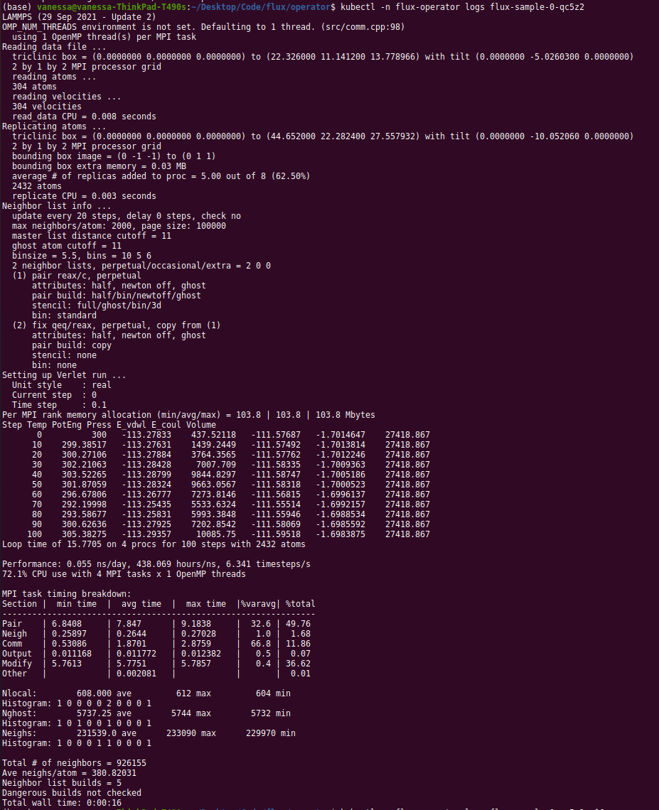

# Lammps on Google Cloud

 **[MiniCluster YAML](https://github.com/flux-framework/flux-operator/blob/main/examples/storage/google/lammps/minicluster.yaml)**

This basic tutorial will walk through creating a MiniCluster to run LAMMPS! You should have
already [setup your workspace](setup.md)

**Note** this has not been tested with the Version 2 Flux Operator.

```{include} includes/basic-setup.md
```

Now let's run a short experiment with LAMMPS!

## Custom Resource Definition

The Custom Resource Definition (CRD) defines our MiniCluster, and is what we hand to the flux
operator to create it.  Here is the CRD for a small lammps run.

```yaml
apiVersion: flux-framework.org/v1alpha2
kind: MiniCluster
metadata:
  name: flux-sample
spec:
  size: 4
  logging:
    quiet: true
  containers:
    - image: ghcr.io/converged-computing/metric-lammps:latest
      workingDir: /opt/lammps/examples/reaxff/HNS
      command: lmp -v x 2 -v y 2 -v z 2 -in in.reaxc.hns -nocite
```


## Create the Lammps Job

Now let's apply the custom resource definition to create the lammps MiniCluster!
The file we generated above should be in your present working directory.

```bash
$ kubectl apply -f minicluster.yaml
```

There are different ways to see logs for pods. First, see pods running and state.
You probably want to wait until the state changes to `Running`
because this is where we are pulling the chonker containers.

```bash
$ kubectl get -n flux-operator pods
```

If you need to debug (or see general output for a pod about creation) you can do:

```bash
$ kubectl describe pods flux-sample-0-742bm
```

And finally, the most meaty piece of metadata is the log for the pod,
where the Flux Operator will be setting things up and starting flux.

```bash
# Add the -f to keep it hanging
$ kubectl  logs flux-sample-0-742bm -f
```

To get logs for the operator itself:

```bash
$ kubectl logs -n operator-system operator-controller-manager-56b5bcf9fd-j2g75
```

And when you are done:

```bash
$ kubectl delete -f minicluster.yaml
```

and wait until the pods are gone.

```bash
$ kubectl get pods
No resources found in flux-operator namespace.
```

For fun, here is the first successful run of Lammps using the Flux Operator on GCP
ever!



```{include} includes/cleanup.md
```

## Customization and Debugging

### Firewall

When I first created my cluster, the nodes could not see one another. I added a few
flags for networking, and looked at firewalls as follows:

```bash
$ gcloud container clusters describe flux-cluster --zone us-central1-a | grep clusterIpv4Cidr
```
I didn't ultimately change anything, but I found this useful.