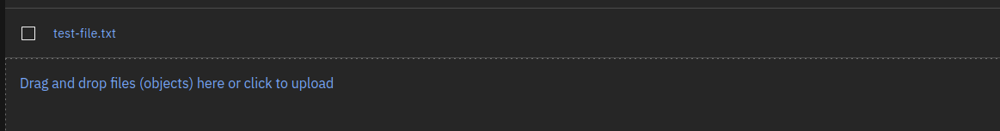

# IBM Cloud

For this tutorial you will need to create or have access to an account on [IBM Cloud](https://cloud.ibm.com/).
We are going to use the [IBM Kubernetes Service](https://cloud.ibm.com/docs/containers?topic=containers-getting-started).

<div class="result docutils container">
<div class="warning admonition">
<p class="admonition-title">Warning</p>
    <p>IBM Cloud uses a plugin with a deprecated feature, a FlexVolume.
    Underlying this volume we use s3f3, and in our testing while the plugin
    mounts successfully, at least running Snakemake, there were errors
    that popped up with respect to finding objects in storage. The example
    here shows how to upload files to a bucket if needed, but is largely
    a "hello world" that simply mounts and writes files to a bucket. If you
    run into issues, we suggest you look at s3fs and the plugin options
    for mounting. We hope that in the future IBM provides a more traditional
    CSI plugin.
</p>
</div>
</div>


## Setup

### Credentials

IBM works by way of [access keys](https://cloud.ibm.com/docs/account?topic=account-userapikey&interface=ui#userapikey) for the API.
If you click on your profile in the top right of the console, you can click "Log in to CLI and API" and a box will pop up.
You will want to copy paste the first command that logs in as follows:

```bash
$ ibmcloud login -a https://cloud.ibm.com -u passcode -p xxxxxxx
```

And then choose a zone (e.g., us-east). 

### Install

You'll first need to [install the ibmcloud](https://cloud.ibm.com/docs/cli?topic=cli-getting-started) command line
client.

```bash
$ curl -fsSL https://clis.cloud.ibm.com/install/linux > install.sh
$ chmod +x install.sh
$ ./install.sh
```

This should create the `ibmcloud` executable on your path.

```bash
$ which ibmcloud
```
```console
/usr/local/bin/ibmcloud
```

Ensure the [storage plugin](https://cloud.ibm.com/docs/cloud-object-storage?topic=cloud-object-storage-cli-plugin-ic-cos-cli) is installed
along with the [kubernetes plugin](https://cloud.ibm.com/docs/containers?topic=containers-cs_cli_install):

```bash
$ ibmcloud plugin install cloud-object-storage
$ ibmcloud plugin install container-service

# And view your current config
$ ibmcloud cos config list
```

If you are doing this for the first time, you'll notice the CRN is blank. We will create a CRN when we push objects to the bucket.
In addition to this client, you'll need [aws](https://docs.aws.amazon.com/cli/latest/userguide/cli-chap-getting-started.html) and [kubectl](https://kubernetes.io/docs/tasks/tools/).


## Accessing Storage on IBM Cloud

Akin to how we created a local volume, we can do something similar, but instead of pointing the Flux Operator
to a volume on the host (e.g., in MiniKube) we are going to point it to a storage bucket where we will interact
with some workflow. IBM Cloud has an s3-like storage option we can use.


### Prepare Data

This example shows preparing snakemake data, however you don't need to do this to run the example
to create a file in storage.

<details>

<summary>Instructions for preparing Snakemake data</summary>

```bash
$ git clone --depth 1 https://github.com/snakemake/snakemake-tutorial-data /tmp/workflow
```

You'll want to add the [Snakefile](https://github.com/rse-ops/flux-hpc/blob/main/snakemake/atacseq/Snakefile) for your workflow
along with a [plotting script](https://github.com/rse-ops/flux-hpc/blob/main/snakemake/atacseq/scripts/plot-quals.py):

```bash
$ wget -O /tmp/workflow/Snakefile https://raw.githubusercontent.com/rse-ops/flux-hpc/main/snakemake/atacseq/Snakefile
$ mkdir -p /tmp/workflow/scripts
$ wget -O /tmp/workflow/scripts/plot-quals.py https://raw.githubusercontent.com/rse-ops/flux-hpc/main/snakemake/atacseq/scripts/plot-quals.py
```

Delete GitHub/git assets:

```bash
$ rm -rf .git .github
```

You should have this structure:

```bash
$ tree /tmp/workflow
```
```
/tmp/workflow/
├── data
│   ├── genome.fa
│   ├── genome.fa.amb
│   ├── genome.fa.ann
│   ├── genome.fa.bwt
│   ├── genome.fa.fai
│   ├── genome.fa.pac
│   ├── genome.fa.sa
│   └── samples
│       ├── A.fastq
│       ├── B.fastq
│       └── C.fastq
├── Dockerfile
├── environment.yaml
├── README.md
├── scripts
│   └── plot-quals.py
└── Snakefile
```

</details>

Let's first [create a bucket](https://cloud.ibm.com/docs/cloud-object-storage?topic=cloud-object-storage-cli-plugin-ic-cos-cli#ic-create-bucket),
and this will use [this plugin](https://github.com/IBM/ibmcloud-cos-cli).
Following [these instructions](https://ibm.github.io/kubernetes-storage/Lab5/cos-with-s3fs/COS/).
The first step is to grant a service authorization in the cloud console, which looks like this:


And then read the next section to understand how to create a service and bucket.

<details>

<summary>Creating the IBM Cloud Storage</summary>

We first need to create a service account:

```bash
# This is usually "Default" - try doing "ibmcloud resource groups"
RESOURCEGROUP=$(ibmcloud resource groups --output json | jq -r '.[0].name') 
COS_NAME_RANDOM=$(date | md5sum | head -c10)
COS_NAME=$COS_NAME_RANDOM-cos-1
COS_CREDENTIALS=$COS_NAME-credentials
COS_PLAN=Lite
COS_BUCKET_NAME=flux-operator-storage
REGION=us-east
COS_PRIVATE_ENDPOINT=s3.private.$REGION.cloud-object-storage.appdomain.cloud
```

And now we can make the service instance:

```bash
$ ibmcloud resource service-instance-create $COS_NAME cloud-object-storage $COS_PLAN global -g $RESOURCEGROUP
```

And list to ensure it was created (repeats the output above for the most part, but can be run separately or
after the fact):

```bash
$ ibmcloud resource service-instance $COS_NAME
```

Next, set the GUID of the object storage instance,

```bash
COS_GUID=$(ibmcloud resource service-instance $COS_NAME --output json | jq -r '.[0].guid')
echo $COS_GUID
```

And add credentials so you can authenticate with IAM. 

```bash
$ ibmcloud resource service-key-create $COS_CREDENTIALS Writer --instance-name $COS_NAME --parameters '{"HMAC":true}'
```

And generate the API key in json:

```bash
COS_APIKEY=$(ibmcloud resource service-key $COS_CREDENTIALS --output json | jq -r '.[0].credentials.apikey')
echo $COS_APIKEY
```

Now we can (finally) create a bucket, first getting the CRN:

```bash
COS_CRN=$(ibmcloud resource service-key $COS_CREDENTIALS --output json | jq -r '.[0].credentials.resource_instance_id')
echo $COS_CRN
```
Add the CRN:

```bash
$ ibmcloud cos config crn --crn $COS_CRN
```

Verify that it shows up:

```bash
$ ibmcloud cos config list
```

And then create the bucket:

```bash
$ ibmcloud cos bucket-create --bucket $COS_BUCKET_NAME --region $REGION
```

And verify it was created:

```bash
$ ibmcloud cos list-buckets --ibm-service-instance-id $COS_CRN
```

</details>

When you have your storage, given some data, you would then upload the workflow using the `aws` client. We will first need to make a service
credential. I did this by clicking the top left hamburger menu, and then "[Resource List](https://cloud.ibm.com/resources)" and clicking the arrow
to expand storage, clicking on the instance ID, and then I saw my bucket! Note that for small data, you can click "Upload" on the right
side and select a folder. But likely you want to do it from the command line - you can find your AWS access token and secret in this json
payload under credentials->cos_hmac_keys:

```bash
$ ibmcloud resource service-key $COS_CREDENTIALS --output json
```

Export them to the environment.

```bash
export AWS_ACCESS_KEY_ID=xxxxxxxxxxxxxxxxxxxxxxxxxxxxxxxx
export AWS_SECRET_ACCESS_KEY=xxxxxxxxxxxxxxxxxxxxxxxxxxxxxxxxxxxxxx
```

And then you should be able to list your (currently empty) bucket:

```bash
COS_BUCKET_NAME=flux-operator-storage
REGION=us-east
```
```bash
$ aws s3 ls $COS_BUCKET_NAME --endpoint-url https://s3.${REGION}.cloud-object-storage.appdomain.cloud
```

Click the accordion to see examples of uploading data (not necessary for this tutorial):

<details>

<summary>Example to Upload Data</summary>

```bash
$ aws s3 cp --recursive /tmp/workflow/ s3://${COS_BUCKET_NAME}/snakemake-workflow --endpoint-url https://s3.${REGION}.cloud-object-storage.appdomain.cloud
```

Do a listing again to ensure everything is there!

```bash
$ aws s3 ls s3://${COS_BUCKET_NAME}/snakemake-workflow/ --endpoint-url https://s3.${REGION}.cloud-object-storage.appdomain.cloud
```

You can also see the created files in the web interface:


</details>

For the tutorial here, it's fine to have an empty bucket. We will simply write files to it.

### Create Cluster

Next let's create a cluster called "flux-operator," following [these instructions](https://www.kubeflow.org/docs/distributions/ibm/create-cluster/).

```bash
# Do ibmcloud ks versions to see versions available
# I left unset to use the default
# export KUBERNETES_VERSION=1.26

# ibmcloud ks locations
export CLUSTER_ZONE=dal12
export WORKER_NODE_PROVIDER=classic
export CLUSTER_NAME=flux-operator
```

Choose a worker node instance type:

```bash
$ ibmcloud ks flavors --zone dal12 --provider classic
export WORKER_NODE_FLAVOR="u3c.2x4"
```

And then create the cluster!

```bash
$ ibmcloud ks cluster create ${WORKER_NODE_PROVIDER} \
  --name=$CLUSTER_NAME \
  --zone=$CLUSTER_ZONE \
  --flavor ${WORKER_NODE_FLAVOR} \
  --workers=4 
```

If you get an error about providing a VLAN, then do:


```bash
$ ibmcloud ks vlans --zone ${CLUSTER_ZONE}
```

and set the public and private VLAN ids to environment variables `PUBLIC_VLAN_ID` and `PRIVATE_VLAN_ID`

```bash
$ ibmcloud ks cluster create ${WORKER_NODE_PROVIDER} \
  --name=$CLUSTER_NAME \
  --zone=$CLUSTER_ZONE \
  --flavor ${WORKER_NODE_FLAVOR} \
  --workers=4 \
  --private-vlan ${PRIVATE_VLAN_ID} \
  --public-vlan ${PUBLIC_VLAN_ID} 
```

The instructions in the linked tutorial mention to use a command line tool to check status, but this didn't work for me.
Instead I watched until the cluster was ready on the [IBM Cloud Kubernetes](https://cloud.ibm.com/kubernetes/clusters) page.
Once it's ready, you should be able to list:

```bash
$ ibmcloud ks cluster ls
```
```console
OK
Name            ID                     State    Created          Workers   Location   Version       Resource Group Name   Provider
flux-operator   cg54590d0b7conrbfmtg   normal   25 minutes ago   4         Dallas     1.25.6_1534   Default               classic
```

And then switch the kubernetes context to use it:

```bash
$ ibmcloud ks cluster config --cluster ${CLUSTER_NAME}
```
```console
The configuration for flux-operator was downloaded successfully.

Added context for flux-operator to the current kubeconfig file.
You can now execute 'kubectl' commands against your cluster. For example, run 'kubectl get nodes'.
```

Make sure all worker nodes are up with the command below

```bash
$ kubectl get nodes
```

and make sure all the nodes are in Ready state. Next we can move on to installing the operator!


### Deploy Operator

To deploy the Flux Operator, [choose one of the options here](https://flux-framework.org/flux-operator/getting_started/user-guide.html#production-install) to deploy the operator. Whether you apply a yaml file, use [flux-cloud](https://converged-computing.github.io/flux-cloud) or clone the repository and `make deploy` you will see the operator install to the `operator-system` namespace.

For a quick "production deploy" from development, the Makefile has a directive that will build and push a `test` tag (you'll need to edit `DEVIMG` to be one you can push to) and then generate a
yaml file targeting that image, e.g.,

```bash
$ make test-deploy
$ kubectl apply -f examples/dist/flux-operator-dev.yaml
```

Ensure the `operator-system` namespace was created:

```bash
$ kubectl get namespace
```
```console
NAME              STATUS   AGE
default           Active   28m
ibm-cert-store    Active   7m29s
ibm-operators     Active   27m
ibm-system        Active   27m
kube-node-lease   Active   28m
kube-public       Active   28m
kube-system       Active   28m
operator-system   Active   11s
```

And you can find the name of the operator pod as follows:

```bash
$ kubectl get pod --all-namespaces
```
```console
operator-system   operator-controller-manager-56b5bcf9fd-m8wg4               2/2     Running   0          73s
```

And wait until that is Running.

### Create Flux Operator namespace

Make your namespace for the flux-operator custom resource definition (CRD), which is the yaml file above that generates the MiniCluster:

```bash
$ kubectl create namespace flux-operator
```

### Install the Container Storage Plugin

We did a combined approach of using helm and our own YAML.

<details>

<summary>Instructions for Generation of YAML</summary>

If you do want to use helm to reproduce this, you will need to [install helm](https://helm.sh/docs/intro/install/). First,
add the [IBM repository](https://github.com/IBM/charts/tree/5870731bfebc867a47fec79507f2f7f616688e25/stable/ibm-object-storage-plugin) to helm:

```bash
$ helm repo add ibm-helm https://raw.githubusercontent.com/IBM/charts/master/repo/ibm-helm
```
Then you'll want to update the helm IBM repository:

```bash
$ helm repo update
$ helm plugin remove ibmc || echo "No ibmc plugin installed"
```

And pull and install the latest:

```bash
$ helm fetch --untar ibm-helm/ibm-object-storage-plugin
$ helm plugin install ./ibm-object-storage-plugin/helm-ibmc
```

Ensure you set the right permissions:
```bash
$ chmod 755 /home/${USER}/.local/share/helm/plugins/helm-ibmc/ibmc.sh
```
And then berify installation:

```bash
$ helm ibmc --help
```

The output version of the Helm version needs to be >3.0. Then we can inspect
variables:

```bash
$ helm show values ibm-helm/ibm-object-storage-plugin
```

```console
replicaCount: 1
maxUnavailableNodeCount: 1

# Change license to true to indicate have read and agreed to license agreement
# https://www.apache.org/licenses/LICENSE-2.0
license: false

image:
  providerImage:
    # This image is required only for IBM Cloud clusters
    ibmContainerRegistry: icr.io/ibm/ibmcloud-provider-storage:1.30.6
  pluginImage:
    ibmContainerRegistry: icr.io/ibm/ibmcloud-object-storage-plugin@sha256:ce509caa7a47c3329cb4d854e0b3763081ac725901e40d5e57fe93b6cd125243
    publicRegistry: icr.io/cpopen/ibmcloud-object-storage-plugin@sha256:ce509caa7a47c3329cb4d854e0b3763081ac725901e40d5e57fe93b6cd125243
  driverImage:
    ibmContainerRegistry: icr.io/ibm/ibmcloud-object-storage-driver@sha256:8c91974660bf98efc772f369b828b3dbcea5d6829cbd85e6321884f4c4eabe09
    publicRegistry: icr.io/cpopen/ibmcloud-object-storage-driver@sha256:8c91974660bf98efc772f369b828b3dbcea5d6829cbd85e6321884f4c4eabe09
  pullPolicy: Always

# IAM endpoint url
iamEndpoint: https://iam.cloud.ibm.com
iamEndpointVPC: https://private.iam.cloud.ibm.com

# IBMC || IBMC-VPC || RHOCP || SATELLITE
provider: RHOCP

# Container platform [ K8S vs OpenShift ]
platform: OpenShift

# Datacenter name where cluster is deployed (required only for IKS)
dcname: ""
region: ""
# Worker node's OS [ redhat || debian ]
workerOS: redhat

# COS endpoints and COS storageClass configuration
# For satellite clusters, to use aws, wasabi or ibm object storage, please provide the s3Provider(aws/wasabi/ibm) and respective storageClass(region) values.
# If user provides all 3 values endpoint, storageClass and s3Provider, precedence is given to storageClass and s3Provider.
# To input endpoint explicitly, input only endpoint and storageClass and skip s3Provider.
# For non-satellite rhocp clusters, please provide cos endpoint and cos storageclass.

cos:
  # The s3 endpoint url for the targeted object storage service; format - https://<Endpoint URL>
  endpoint: "NA"
  # The region in which the bucket has to be created as per the object storage service provider, ex - us-south
  storageClass: ""
  # Supported object storage service providers are aws, ibm, wasabi
  s3Provider: ""

secondaryValueFile: ibm/values.yaml
secondaryValueFileSat: satellite/values.yaml

arch: amd64

resource:
  memory: 500Mi
  cpu: 500m
  ephemeralStorageReq: 5Mi
  ephemeralStorageLimit: 105Mi

# /etc/kubernetes for RHOCP else /usr/libexec/kubernetes
kubeDriver: /usr/libexec/kubernetes

bucketAccessPolicy: false

quotaLimit: false

allowCrossNsSecret: true

# current and previous
s3fsVersion: current
```

Of the values we can set, we likely want to set the following:

```diff
# Change license to true to indicate have read and agreed to license agreement
# https://www.apache.org/licenses/LICENSE-2.0
- license: false
+ license: true

# IBMC || IBMC-VPC || RHOCP || SATELLITE
- provider: RHOCP
+ provider: IBMC

# Container platform [ K8S vs OpenShift ]
- platform: OpenShift
+ platform: K8S

# Worker node's OS [ redhat || debian ]
- workerOS: redhat
+ workerOS: debian

# COS endpoints and COS storageClass configuration
# For satellite clusters, to use aws, wasabi or ibm object storage, please provide the s3Provider(aws/wasabi/ibm) and respective storageClass(region) values.
# If user provides all 3 values endpoint, storageClass and s3Provider, precedence is given to storageClass and s3Provider.
# To input endpoint explicitly, input only endpoint and storageClass and skip s3Provider.
# For non-satellite rhocp clusters, please provide cos endpoint and cos storageclass.

cos:
  # The s3 endpoint url for the targeted object storage service; format - https://<Endpoint URL>
-  endpoint: "NA"
+ endpoint: "https://s3.us-east.cloud-object-storage.appdomain.cloud/"
  # Supported object storage service providers are aws, ibm, wasabi
-  s3Provider: ""
+  s3Provider: "ibm"
```

</details>

Using the above, we would install the plugin directly with our customizations:

```bash
$ helm ibmc install ibm-object-storage-plugin ibm-helm/ibm-object-storage-plugin --set license=true --set provider=IBMC --set platform=K8s --set workerOS=debian --set cos.s3Provider=ibm
```

Give a minute or so, and then check that the storage classes were created correctly:

```bash
$ kubectl get storageclass | grep 'ibmc-s3fs'
```

Then make sure the plugin pods are running (in "RUNNING" state):

```bash
$ kubectl get pods -n ibm-object-s3fs -o wide | grep object
```

Ensure the secret exists in the default namespace:

```bash
$ kubectl get secrets -n default | grep icr-io
```

We will want to copy the secret to ibm-object-s3fs namespace

```bash
$ kubectl get secret -n default all-icr-io -o yaml | sed 's/default/ibm-object-s3fs/g' | kubectl -n ibm-object-s3fs create -f -
```

And then make sure that the image pull secret is available in the ibm-object-s3fs  namespace.

```bash
$ kubectl get secrets -n ibm-object-s3fs | grep icr-io
```

Verify again that the state of the plugin pods changes to "Running".

```bash
$ kubectl get pods -n ibm-object-s3fs | grep object
```

Finally, create a secret with our service ID to give access to storage. To get your API key:

```bash
$ ibmcloud resource service-key $COS_CREDENTIALS --output json
```

If you are doing the full tutorial, this is the variable under `$COS_APIKEY` and the 
the service instance id should be `$COS_NAME`.

```bash
$ kubectl create secret generic s3-secret --namespace=flux-operator --type=ibm/ibmc-s3fs  --from-literal=api-key=${COS_APIKEY} --from-literal=service-instance-id=${COS_NAME}
```

At this point we have the storage driver running, along with the storage class and secret, and we should
attempt to use it with the Flux Operator.

### Example MiniCluster

 **[MiniCluster YAML](https://github.com/flux-framework/flux-operator/blob/main/examples/storage/ibm/minicluster.yaml)**

Note that we are setting the `commands: -> runFluxAsRoot` to true. This isn't ideal, but it was the
only way I could get the storage to both be seen and have permission to write there. Let's create the job!
Since the storage plugin uses a FlexDriver, and this is being deprecated, we need to create the persistent
volume claim manually, and doing so will create the volume, and then we provide both to the operator to use.
You can first verify there are no PVs or PVs on the cluster:

```bash
$ kubectl get -n flux-operator pv,pvc
```
```console
No resources found
```

Here is how to create the persistent volume claim.

```bash
$ kubectl apply -f examples/storage/ibm/pvc.yaml
```

Try listing again:

```bash
$ kubectl get -n flux-operator pv,pvc
```
```console
NAME                                                        CAPACITY   ACCESS MODES   RECLAIM POLICY   STATUS   CLAIM                STORAGECLASS                  REASON   AGE
persistentvolume/pvc-8cd3cbb8-d0d4-4310-bc9d-748bb70ab8ca   25Gi       RWX            Delete           Bound    flux-operator/data   ibmc-s3fs-standard-regional            4s

NAME                         STATUS   VOLUME                                     CAPACITY   ACCESS MODES   STORAGECLASS                  AGE
persistentvolumeclaim/data   Bound    pvc-8cd3cbb8-d0d4-4310-bc9d-748bb70ab8ca   25Gi       RWX            ibmc-s3fs-standard-regional   4s
```

The volume and claim should both be "Bound" and not "Lost" or anything like that. If this isn't the case, use `kubectl describe` to see details
of why it might be. Importantly, we need to get the name of the claim for the MiniCluster. It should be the one that you provided in your
spec, but just in case, here is how to check with jq:

```bash
$ kubectl get -n flux-operator pvc -o json | jq ".items[].metadata.name"
"data"
```

This is the name of the claim that you need to have in your MiniCluster under "existingVolumes":

```yaml
# This is an existing PVC (and associated PV) we created before the MiniCluster
existingVolumes:
  data:
    path: /workflow
    claimName: data  
```

Next, we are going to create the MiniCluster, pointing to this claim:

```bash
$ kubectl apply -f examples/storage/ibm/minicluster.yaml
```

It will take 4+ minutes or so to (again) pull the new container. You can check pods:

```bash
$ kubectl get -n flux-operator pods
```

You can watch the broker to see if the files mounted (toward the top of the log) and to see when Snakemake starts:

```bash
$ kubectl logs -n flux-operator flux-sample-0-xxxx -f
```

Note that nothing will start running until all the pods are ready, so you'll want to wait to see that the "quorum is reached"
and then the storage will be mounted (a listing happens at the beginning) and the file will be touched.
If you check your cloud storage interface after the job, you should see the test file:



And that's it! This can be a starting base for customizing your own workflows to use IBM cloud.
Note that the s3fs is a bit fussy when it comes to mounting, and if you run into issues you
should [explore the options](https://github.com/s3fs-fuse/s3fs-fuse) and see what is already
[exposed by the plugin](https://github.com/IBM/ibmcloud-object-storage-plugin).

## Clean up

To clean up:

```bash
# Delete the cluster
$ ibmcloud ks cluster rm --force-delete-storage -c ${CLUSTER_NAME}

# Delete storage
$ ibmcloud cos bucket-delete --bucket $name_bucket
```
