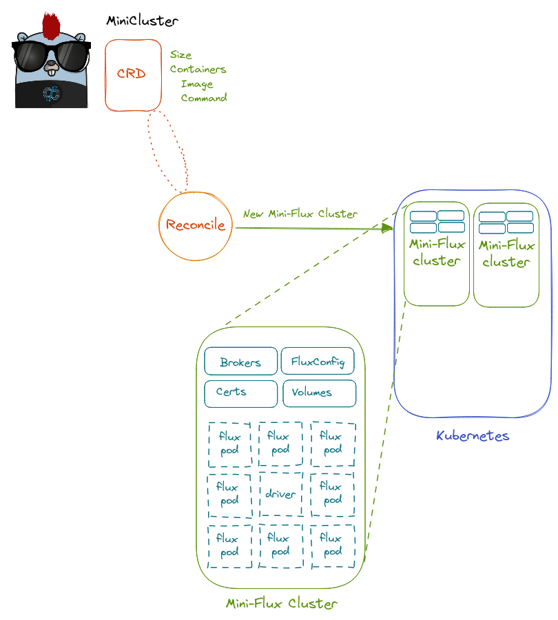

# Design 3.3

This design is an extended 3, updated for the new year (and work TBA).

## Summary

 - A **MiniCluster** is an [indexed job](https://kubernetes.io/docs/tasks/job/indexed-parallel-processing-static/) so we can create N copies of the "same" base containers (each with Flux, and the connected workers in our cluster).
 - Multiple containers are now supported, where one is required to be the Flux runner, and others provide services to it.
 - The flux config is written to a volume at `/etc/flux/config` (created via a config map) as a brokers.toml file.
 - The curve certificate is generated using the Flux Runner container before the cluster is brought up, retrieved via logs, and then written to the job pods as a config map.
 - The startup scripts "wait.sh" (customized per container) handles parsing user preferences and starting the MiniCluster. The main broker runs flux start with the primary command, and the worker nodes run flux start to register with it.
 - As the pods use the same base container with Flux, the munge key should already be equivalent. 
 - A 'test' mode available in the CRD is provided to quiet all output except for the job.
 - Networking of the pods works by way of exposing a service that includes the Pod subdomain. We add fully qualified domain names to the pods so that the `hostname` command matches the full name, and Flux is given the full names in its broker.toml.
 - The main pod either runs `flux start` with a web service (creating a persistent "Mini Cluster" or `flux start` with a specific command (if provided in the CRD) in which case the command runs, and the jobs finish and the cluster goes away.

This means that:

1. A MiniCluster is a CRD that includes containers (and for each, options such as image and command) and size
2. Creating a MiniCluster first creates Config Maps, Volumes (TBA), and secrets and then an indexed job with pods that use them
3. Index 0 is "special" in that is creates the main shared assets, and launches the main command or server (the others start with `flux start` and a sleep and essentially register to the cluster.
4. Flux is required in the running container image (from the user), however the Flux RESTful API is not (it is installed when the server comes up).
5. For the persistent case, jobs can be submit until the cluster is stopped or deleted. For the ephemeral case (providing the command) the job runs and the cluster goes away.

- [Link on Excalidraw](https://excalidraw.com/#json=_F0hUUB9knFEry2FykSS4,MaGmgcsyq_JZ2_MrZ3XRIQ)

