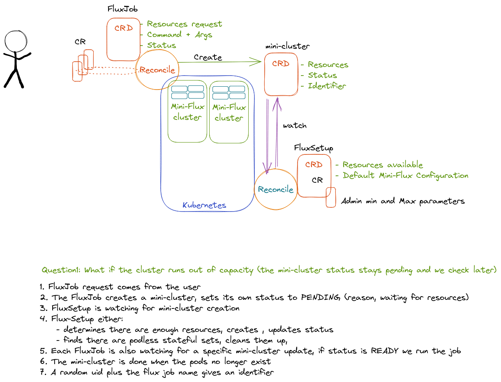

# Design 1

This was based on an early chat with Eduardo about operator design. I had no idea what I was doing! We decided to go for a simple design:

- Flux: would have a CR that defines a job and exposes an entrypoint command / container to the user
- FluxSetup would have most of the content of [here](https://lc.llnl.gov/confluence/display/HFMCCEL/Flux+Operator+Design) and be more of an internal or admin setup.

To generate FluxSetup I think I could (maybe?) have run this command again, but instead I added a new entry to the [PROJECT](https://github.com/flux-framework/flux-operator/blob/main/PROJECT) and then generated [api/v1alpha1/fluxsetup_types.go](https://github.com/flux-framework/flux-operator/blob/main/api/v1alpha1/fluxsetup_types.go) from the `flux_types.go` (and changing all the references from Flux to FluxSetup). I also needed to (manually) make `controllers/fluxsetup_controller.go` (no longer exists) and ensure it was updated to use FluxSetup, and then adding
it's creation to [main.go](https://github.com/flux-framework/flux-operator/blob/main/main.go). Yes, this is a bit of manual work, but I think I'll only need to do it once.
At this point, I needed to try and represent what I saw in the various config files in this types file.

The [original excalidraw](https://excalidraw.com/#room=5f6c9a04c41459f38834,XcXM7oMoSWYXkAJS4BQSXQ).