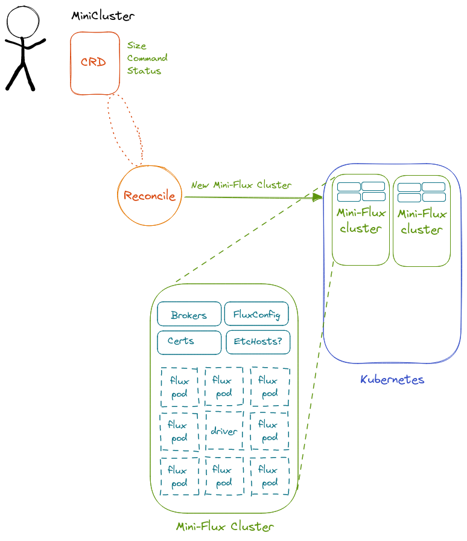

# Design 3.1

This design is a simple design based around a single custom resource definition

## Details 

 - A **MiniCluster**: is a specification provided by a user with a container image, command, and size to create (over several reconciles) ConfigMaps, Secrets, and a batchv1.Job with pods (containers) and volumes. Once this is created, we conceptually have a MiniCluster within K8s running the user's job! This is a CRD, so the user submitting it owns that MiniCluster.

We discussed this at our meeting on 9-07-22 and wanted to remove the complexity of design 2, and have a CRD that directly manages resources. In more detail, this means that:

- A MiniCluster is a CRD that includes an image, command, and size
- Creating a MiniCluster first creates Config Maps and secrets (and possibly etc hosts) and then a batch job with pods that use them
- Flux is required in the running container image (from the user)
- The job runs to completion and has some final state

- [Link on Excalidraw](https://excalidraw.com/#json=3p1bpgBFeNWpqUJjrxDmi,wZPk1I0FHI4POAAJfIdNBg)


## What is Happening?

If you follow the commands to apply a custom resource definition to this cluster design, 
you'll see a lot of terminal output, and it might not be clear what is happening. Let's talk about it here. 
Generally, you'll first see the config maps and supporting resources 
being created. Since we are developing (for the time being) on a local machine, instead of a persistent volume
claim (which requires a Kubernetes cluster with a provisioner) you'll get a persistent volume
written to `/tmp` in the job namespace. If you try to use the latter it typically freezes.

The first time the pods are created, they won't have ips (yet) so you'll see an empty list in the logs.
As they are creating and getting ips, after that is finished you'll see the same output but with a 
lookup of hostnames to ip addresses, and after it will tell you the cluster is ready.

```
1.6629325562267003e+09  INFO    minicluster-reconciler  🌀 Mini Cluster is Ready!
```
When you are waiting and run `make log` in a separate terminal you'll see output from one of the pods 
in the job. Typically the first bit of time you'll be waiting:

```bash
$ make log
kubectl logs -n flux-operator job.batch/flux-sample
Found 6 pods, using pod/flux-sample-0-njnnd
Host updating script not available yet, waiting...
```
It's waiting for the `/flux_operator/update_hosts.sh` script. When this is available, it will be found
and the job setup will continue, first adding the found hosts to `/etc/hosts` and then (for the main node,
which typically is `<name>-0`). When this happens, you'll see the host file cat to the screen:

```console
Host updating script not available yet, waiting...
# Kubernetes-managed hosts file.
127.0.0.1       localhost
::1     localhost ip6-localhost ip6-loopback
fe00::0 ip6-localnet
fe00::0 ip6-mcastprefix
fe00::1 ip6-allnodes
fe00::2 ip6-allrouters
172.17.0.4      flux-sample-1.flux-sample.flux-operator.svc.cluster.local       flux-sample-1
172.17.0.2 flux-sample-0-flux-sample.flux-operator.svc.cluster.local flux-sample-0
172.17.0.4 flux-sample-1-flux-sample.flux-operator.svc.cluster.local flux-sample-1
172.17.0.6 flux-sample-2-flux-sample.flux-operator.svc.cluster.local flux-sample-2
172.17.0.7 flux-sample-3-flux-sample.flux-operator.svc.cluster.local flux-sample-3
172.17.0.5 flux-sample-4-flux-sample.flux-operator.svc.cluster.local flux-sample-4
172.17.0.8 flux-sample-5-flux-sample.flux-operator.svc.cluster.local flux-sample-5
flux-sample-1 is sleeping waiting for main flux node
```

And then final configs are created, the flux user is created, and the main
node creates the certificate and we start the cluster. You can look at 
`controllers/flux/templates.go`
for all the scripts and logic that are run. It takes about ~90 seconds for the
whole thing to come up and run. If `make log` doesn't show you the main node
(where we run the command) you get `make list` to get the identifier and then:

```bash
$ kubectl logs -n flux-operator flux-sample-0-zfbvm
# or
$ ./script/log.sh flux-sample-0-zfbvm
```

For a multi-container deployment, you'll also need to specify the container name, which
will be your CRD name plus index of the container:

```bash
./script/log.sh flux-sample-0-gnmlj flux-sample-0
```

To see a listing of pods:

```console
$ make list
kubectl get -n flux-operator pods
NAME                  READY   STATUS      RESTARTS   AGE
flux-sample-0-wvs8w   0/1     Completed   0          11m
flux-sample-1-9cz5c   1/1     Running     0          11m
flux-sample-2-hbcrb   1/1     Running     0          11m
flux-sample-3-lzv4s   1/1     Running     0          11m
flux-sample-4-fzxgf   1/1     Running     0          11m
flux-sample-5-9pnwf   1/1     Running     0          11m
```
This functionality will depend on whether you are running a single command,
or a persistent Mini Cluster.
