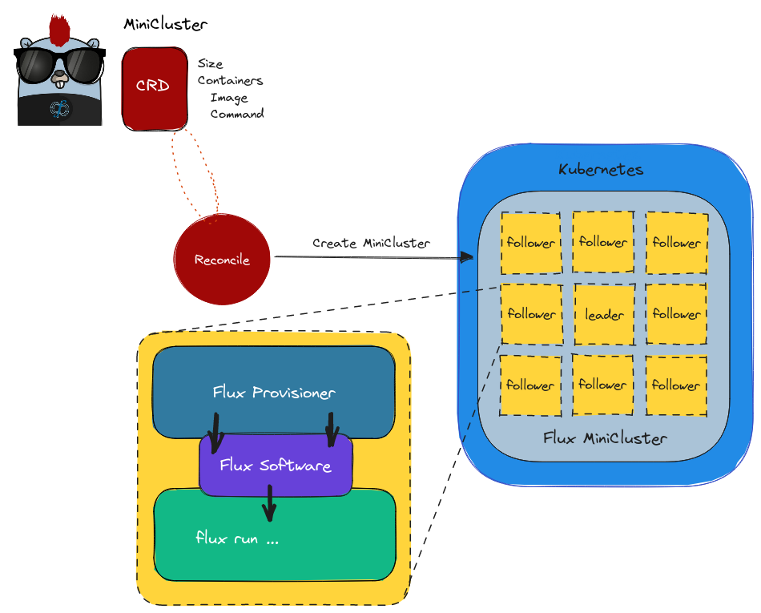

# Design 4.0

We found a solution via the [metrics operator](https://converged-computing.github.io/metrics-operator/getting_started/addons.html#workload-flux) (developed by the same maintainers) for how to fix a huge design
flaw - the fact that the application logic was mixed with the logic for Flux. This design solves that.

## Summary

 - A **MiniCluster** is an [indexed job](https://kubernetes.io/docs/tasks/job/indexed-parallel-processing-static/) so we can create N copies of the "same" base containers.
   - A Flux Provisioner container provides a build of Flux (on some operator system) that is shared with the application container via an empty volume
   - Multiple containers are supported, and one is required to be the Flux runner
   - Multiple containers can either be sidecars, or separate service containers
   - It is possible that more than one container can run Flux, meaning one starts the broker and a second issues a flux submit or similar (not tested)

 - The curve certificate is generated by the operator using ZeroMQ
 - The main broker pod runs flux start with a primary command, and the worker pods run flux start to register with it.
 - Security / generating a munge key is no longer supported (we assume a single-user mode)
 - Networking of the pods works via a headless service that includes the pod subdomain. 

Some caveats or changes to the design:

 - we use an init-container instead of sidecar so the indexed job completes
 - links to python within the view will be broken because the original view path is not preserved, but instead you can target the versioned binary (e.g., python3.11 instead of python)
 - flux restful is being removed, and (when refactored) will be provided as an example application
 - Sidecar service containers are required to have a command. If they don't, they will exit.
 - The sidecar approach does not work with ARM because spack is [not able to build it](https://github.com/spack/spack/issues/41708).

- [Link on Excalidraw](https://excalidraw.com/#json=auIWjzPmpLnss1fP4FdjL,UY4HiAoQ0zH1tFTptDLCXw)
