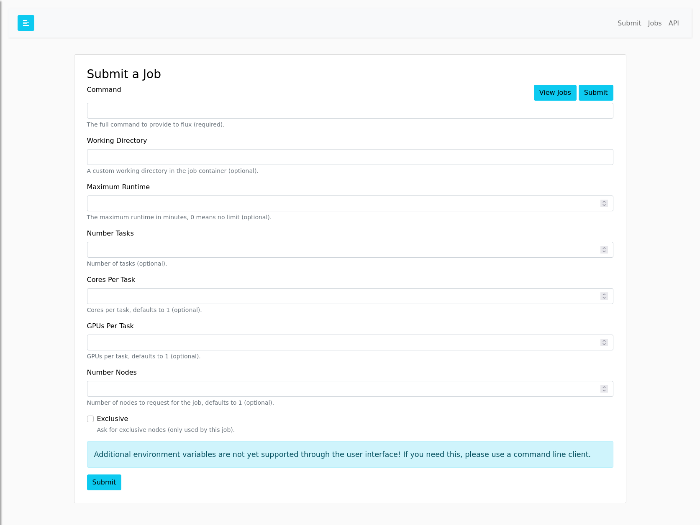

# Jobs

Given a running MiniCluster that exposes a RESTful API, you have several modes for interaction:

1. Submit jobs in the user interface (basic)
2. Submit jobs from the command line "RESTful" or within Python (custom)
3. Use a helper tool "flux-cloud"
4. Submit jobs interacting with Flux via ssh-ing to the pod (advanced)

We provide [clients](https://github.com/flux-framework/flux-restful-api/tree/main/clients) to interact with
a running server, and each will be briefly shown below. The Python client is also included in our [Tutorials](https://flux-framework.org/flux-restful-api/auto_examples/index.html).

## Credentials

Whether you use a command line client, a language SDK, or the web interface - you need your credentials!
The credentials are printed in the log of the index-0. These are the `FLUX_USER` and `FLUX_TOKEN` 
environment variables. A client requires exported them to the environment, and the web interface requires
copy paste into a form. 

```bash
# get the job pod identifier for index 0, the broker
$ kubectl get -n flux-operator pods
$ kubectl logs -n flux-operator ${brokerPod}
```
```console
🔑 Your Credentials! These will allow you to control your MiniCluster with flux-framework/flux-restful-api
export FLUX_TOKEN=9c605129-3ddc-41e2-9a23-38f59fb8f8e0
export FLUX_USER=flux

🌀sudo -u flux flux start -o --config /etc/flux/config ...
```

Note that they appear slightly above the command, which isn't at the bottom of the log!

## Ways to Submit

### 1. User Interface

To see the user interface, you'll first need to do some kind of port forwarding:

```console
kubectl port-forward -n flux-operator flux-sample-0-zdhkp 5000:5000
Forwarding from 127.0.0.1:5000 -> 5000
```

This should be exposed at [http://127.0.0.1:5000](http://127.0.0.1:5000). It's not terribly informative, so
we won't show the main portal here! 🤭

After your MiniCluster is created with a RESTFul API, the easiest thing to do is open the user interface to [http://127.0.0.1:5000](http://127.0.0.1:5000)
After port forwarding in a terminal and then submitting in the job UI (you will need to login with the flux user and token presented in the terminal). Here is the example command to try
for the basic tutorial here:

```console
lmp -v x 2 -v y 2 -v z 2 -in in.reaxc.hns -nocite
```

And the workdir for this default example needs to be:

```console
/home/flux/examples/reaxff/HNS
```


After submit, you can view the job in the jobs table:


And click the identifier to see logs (currently blocking so will wait until it's done, soon won't be!)


And that's it for the example! You can further explore the exposed API in the web interface:


And you can also try using the [RESTFul API Clients](https://flux-framework.org/flux-restful-api/getting_started/user-guide.html) to submit instead
(discussed next). Note that there is currently no way for the RESTful client to ask to destroy the cluster - you'll
still need to use kubectl to do that.

### 2. Command Line or Python

Remember that before starting you'll need to export your `FLUX_USER` and `FLUX_TOKEN` to the environment:

```bash
# get the job pod identifier for index 0, the broker
$ kubectl get -n flux-operator pods
$ kubectl logs -n flux-operator ${brokerPod}
```
```console
🔑 Your Credentials! These will allow you to control your MiniCluster with flux-framework/flux-restful-api
export FLUX_TOKEN=9c605129-3ddc-41e2-9a23-38f59fb8f8e0
export FLUX_USER=flux

🌀sudo -u flux flux start -o --config /etc/flux/config ...
```

Next, you can use the [flux-framework/flux-restful-api](https://flux-framework.org/flux-restful-api/getting_started/user-guide.html#python)
Python client to submit a job.

```bash
$ pip install flux-restful-client
```
And then (after you've started port forwarding) you can either submit on the command line:

```bash
$ flux-restful-cli submit lmp -v x 2 -v y 2 -v z 2 -in in.reaxc.hns -nocite
```
```console
{
    "Message": "Job submit.",
    "id": 19099568570368
}
```
And get info:

```bash
$ flux-restful-cli info 19099568570368
```
```console
{
    "id": 2324869152768,
    "userid": 1234,
    "urgency": 16,
    "priority": 16,
    "t_submit": 1668475082.8024156,
    "t_depend": 1668475082.8024156,
    "t_run": 1668475082.8159652,
    "state": "RUN",
    "name": "lmp",
    "ntasks": 1,
    "nnodes": 1,
    "ranks": "3",
    "nodelist": "flux-sample-3",
    "expiration": 1669079882.0,
    "annotations": {
        "sched": {
            "queue": "default"
        }
    },
    "result": "",
    "returncode": "",
    "runtime": 16.86149311065674,
    "waitstatus": "",
    "exception": {
        "occurred": "",
        "severity": "",
        "type": "",
        "note": ""
    },
    "duration": ""
}
```

Or get the output log!

```bash
$ flux-restful-cli logs 2324869152768
```

<details>

<summary>Logs Output</summary>

```console
LAMMPS (29 Sep 2021 - Update 2)
OMP_NUM_THREADS environment is not set. Defaulting to 1 thread. (src/comm.cpp:98)
using 1 OpenMP thread(s) per MPI task
Reading data file ...
triclinic box = (0.0000000 0.0000000 0.0000000) to (22.326000 11.141200 13.778966) with tilt (0.0000000 -5.0260300 0.0000000)
1 by 1 by 1 MPI processor grid
reading atoms ...
304 atoms
reading velocities ...
304 velocities
read_data CPU = 0.005 seconds
Replicating atoms ...
triclinic box = (0.0000000 0.0000000 0.0000000) to (44.652000 22.282400 27.557932) with tilt (0.0000000 -10.052060 0.0000000)
1 by 1 by 1 MPI processor grid
bounding box image = (0 -1 -1) to (0 1 1)
bounding box extra memory = 0.03 MB
average # of replicas added to proc = 8.00 out of 8 (100.00%)
2432 atoms
replicate CPU = 0.001 seconds
Neighbor list info ...
update every 20 steps, delay 0 steps, check no
max neighbors/atom: 2000, page size: 100000
master list distance cutoff = 11
ghost atom cutoff = 11
binsize = 5.5, bins = 10 5 6
2 neighbor lists, perpetual/occasional/extra = 2 0 0
(1) pair reax/c, perpetual
attributes: half, newton off, ghost
pair build: half/bin/newtoff/ghost
stencil: full/ghost/bin/3d
bin: standard
(2) fix qeq/reax, perpetual, copy from (1)
attributes: half, newton off, ghost
pair build: copy
stencil: none
bin: none
Setting up Verlet run ...
Unit style    : real
Current step  : 0
Time step     : 0.1
Per MPI rank memory allocation (min/avg/max) = 215.0 | 215.0 | 215.0 Mbytes
Step Temp PotEng Press E_vdwl E_coul Volume
0          300   -113.27833    437.52122   -111.57687   -1.7014647    27418.867
10    299.38517   -113.27631    1439.2857   -111.57492   -1.7013813    27418.867
20    300.27107   -113.27884    3764.3739   -111.57762   -1.7012246    27418.867
30    302.21063   -113.28428    7007.6914   -111.58335   -1.7009363    27418.867
40    303.52265   -113.28799      9844.84   -111.58747   -1.7005186    27418.867
50    301.87059   -113.28324    9663.0443   -111.58318   -1.7000524    27418.867
60    296.67807   -113.26777    7273.7928   -111.56815   -1.6996137    27418.867
70    292.19999   -113.25435    5533.6428   -111.55514   -1.6992157    27418.867
80    293.58677   -113.25831    5993.4151   -111.55946   -1.6988533    27418.867
90    300.62636   -113.27925    7202.8651   -111.58069   -1.6985591    27418.867
100    305.38276   -113.29357    10085.748   -111.59518   -1.6983875    27418.867
Loop time of 20.1295 on 1 procs for 100 steps with 2432 atoms

Performance: 0.043 ns/day, 559.152 hours/ns, 4.968 timesteps/s
99.6% CPU use with 1 MPI tasks x 1 OpenMP threads

MPI task timing breakdown:
Section |  min time  |  avg time  |  max time  |%varavg| %total
---------------------------------------------------------------
Pair    | 14.914     | 14.914     | 14.914     |   0.0 | 74.09
Neigh   | 0.39663    | 0.39663    | 0.39663    |   0.0 |  1.97
Comm    | 0.0068084  | 0.0068084  | 0.0068084  |   0.0 |  0.03
Output  | 0.00025632 | 0.00025632 | 0.00025632 |   0.0 |  0.00
Modify  | 4.8104     | 4.8104     | 4.8104     |   0.0 | 23.90
Other   |            | 0.001154   |            |       |  0.01

Nlocal:        2432.00 ave        2432 max        2432 min
Histogram: 1 0 0 0 0 0 0 0 0 0
Nghost:        10685.0 ave       10685 max       10685 min
Histogram: 1 0 0 0 0 0 0 0 0 0
Neighs:        823958.0 ave      823958 max      823958 min
Histogram: 1 0 0 0 0 0 0 0 0 0

Total # of neighbors = 823958
Ave neighs/atom = 338.79852
Neighbor list builds = 5
Dangerous builds not checked
Total wall time: 0:00:20
```

</details>

Or do the same from within Python:

```python
from flux_restful_client.main import get_client

cli = get_client()

# Define our jop
command = "lmp -v x 2 -v y 2 -v z 2 -in in.reaxc.hns -nocite"

# Submit the job to flux
print(f"😴 Submitting job: {command}")
res = cli.submit(command=command)
print(json.dumps(res, indent=4))

# Get job information
print("🍓 Getting job info...")
jobid = res['id']
res = cli.jobs(jobid)
print(json.dumps(res, indent=4))

# Get job output log
print("🍕 Getting job output...")
res = cli.output(jobid)
print(json.dumps(res, indent=4))
```

### 3. Flux Cloud Helper Tool

If you have a set of experiments you want to run on a production cluster, and especially
if you don't want the cluster being up longer than it has to be, check out [Flux Cloud](https://github.com/converged-computing/flux-cloud).
It's a small experiment runner wrapper that makes bringing up the cluster, installing
the operator, running a matrix of experiments, and destroying the cluster much
easier than all the copy pasting of commands typically required! 

### 4. Advanced Shell

You can also submit jobs interacting with Flux via ssh-ing to the pod! This is considered 
advanced, and is good for debugging. As you did before, get your pod listing:

```bash
$ kubectl -n flux-operator pods
```
And then shell in

```bash
$ kubectl exec --stdin --tty -n flux-operator ${brokerPod} -- /bin/bash
```

Note that if you have more than one container, you'll need to include it's name with `-c <container>`.
Also note that if you need to load any custom environments (e.g., something you'd define in the preCommand for a container)
you'll likely need to do that when you shell in.