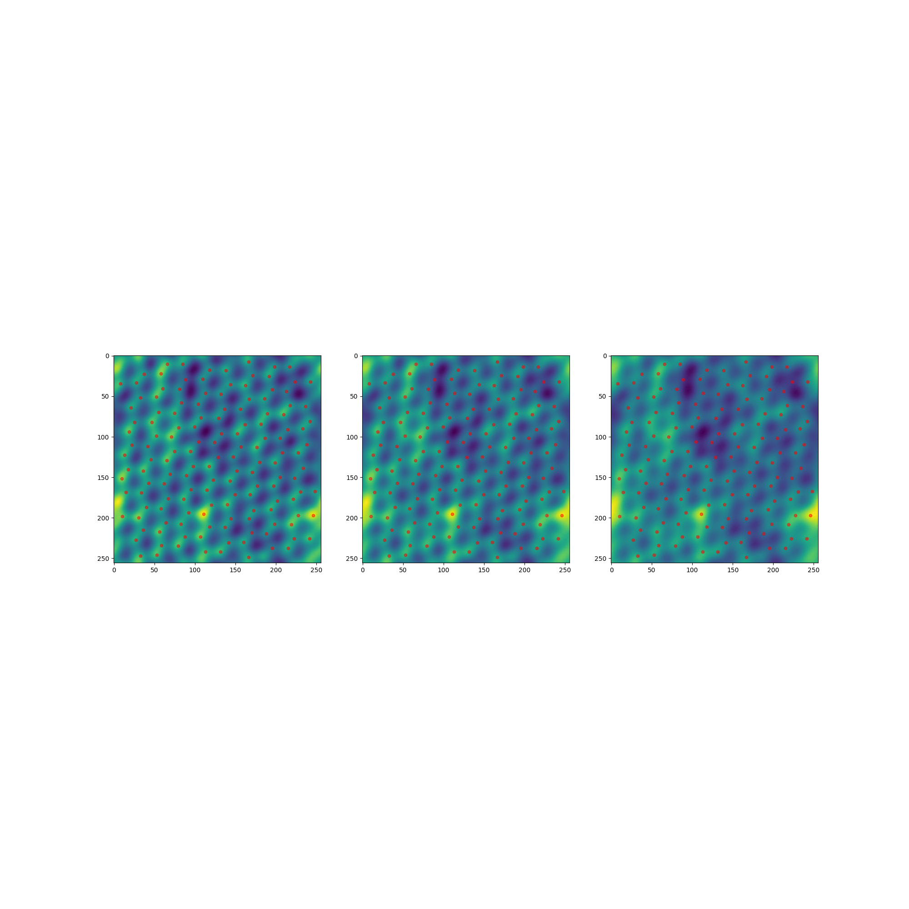
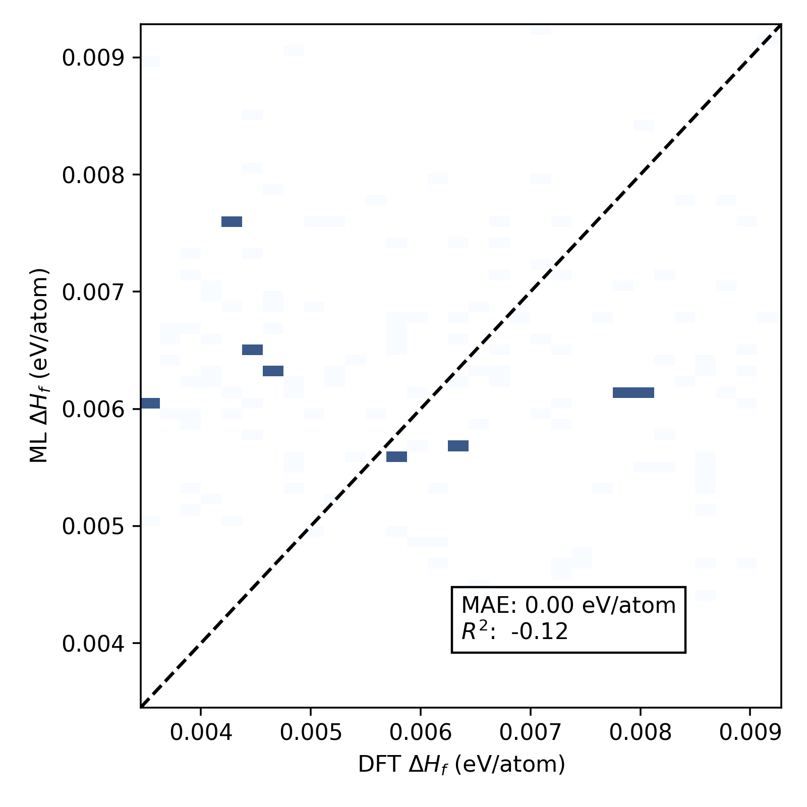
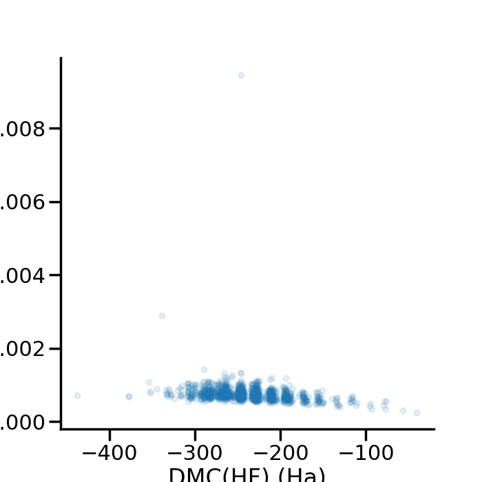

# Foundry

This tutorial example will show using [Foundry](https://github.com/MLMI2-CSSI/foundry) to download a dataset and run an example.

## Credentials

You'll need to generate a credential file that we will provide to the job. This needs
to be done locally (it's recommended to make a Python environment):

```bash
$ python -m venv env
$ source env/bin/activate
$ pip install foundry_ml
```

You'll next want to login with Globus. Yes, this requires an account! I was able
to just login via my institution. Running this command should open a web interface
to authenticate:

```bash
$ python -c "from foundry import Foundry; f = Foundry()"
```
This will generate a credential file in your home directory - let's copy it
here so we can provide it to the minicluster (do NOT add to git!)

```bash
$ cp ~/.globus-native-apps.cfg .
```

## Kind Cluster

We will want to bind the present working directory (with the examples) to our MiniCluster,
and that is easy to do with kind. Create a cluster with the included kind config.
Make sure this is run in the directory context here!

```bash
$ kind create cluster --config kind-config.yaml
```

## Create MiniCluster

Since we have several examples, let's create an interactive cluster so we can run (and watch them run) with flux submit.
If you were doing this at scale you would likely choose one workflow and run headlessly by removing `interactive: true` 
and providing the [minicluster.yaml](minicluster.yaml) with a command. Let's create the namespace and install
the operator: 

```bash
$ kubectl create namespace flux-operator
$ kubectl apply -f ../../../examples/dist/flux-operator-dev.yaml
```

And then create the interactive cluster:

```bash
$ kubectl apply -f minicluster.yaml
```

See pods creating:

```bash
$ kubectl get -n flux-operator pods
```

When the broker (index 0) is running, shell in!

```bash
$ kubectl exec -it -n flux-operator flux-sample-0-fzml6  bash
```

You'll want to connect to the broker.

```bash
$ sudo -E $(env) -E HOME=/home/fluxuser -u fluxuser flux proxy local:///run/flux/local bash
```

### Globus Credentials

Export your Globus credentials (I'm not convinced this is necessary, but the testing example does it, so why not)

```bash
$ export GLOBUS_CONFIG=$(cat .globus-native-apps.cfg)
```

### Run Examples

Now let's cd into the examples directory and run a few! We will run these on the node, but they could
also be run with `flux submit --watch` and a certain number of nodes `-n`

```bash
$ cd ./examples
$ ls
```
```console
atom-position-finding  bandgap  dendrite-segmentation  g4mp2-solvation  oqmd  publishing-guides  qmc_ml  zeolite
```

#### Atom Position Finding

These interactions are run from inside the container:

```bash
$ cd ./atom-position-finding
$ python atom_position_finding.py
```




### Bandgap

Note that downloading the data on this one froze my computer the first time, so be careful!

```bash
$ cd ./bandgap
$ python bandgap_demo.py
```



### QMC ML

Note that downloading the data on this one froze my computer the first time, so be careful!

```bash
$ cd ./qmc_ml
$ python qmc_ml.py
```




And finally, clean up:

```bash
$ kubectl delete -f minicluster.yaml
```

It's not clear yet how these machine learning runs can best integrate with flux, beyond submitting a job
to Flux. We will need to think about this. One design, however, I think could work really nicely here is:

1. Use Foundry for storing data, download a dataset via the broker pre command.
2. Use flux filemap in the batch script (with batch:true and batchRaw: true) to map the data to nodes
3. Run some job that uses the data across the nodes (e.g., MPI or similar)