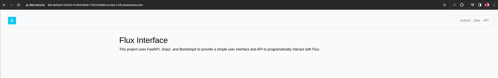
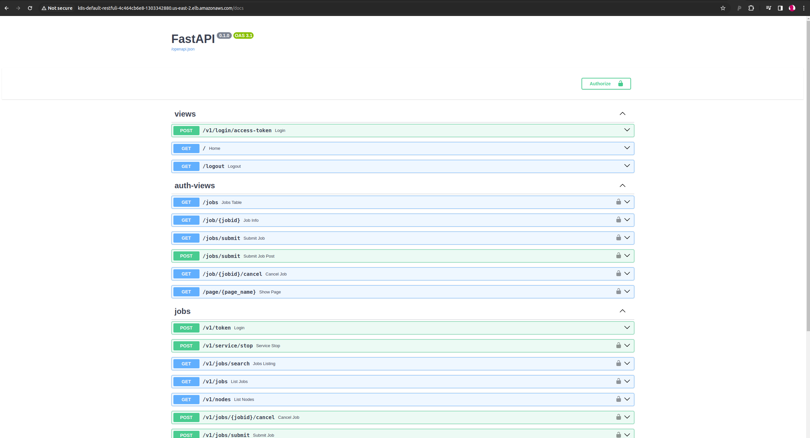
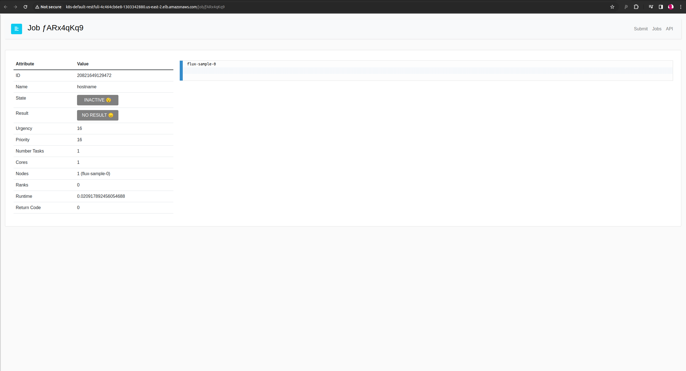
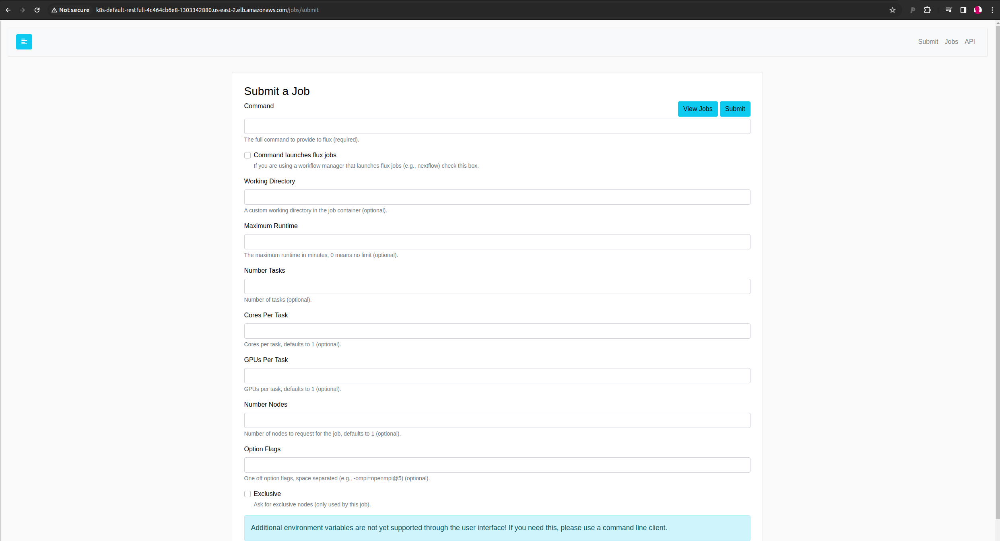

# Flux Restful Sidecar

This example demonstrates installing and running a basic Flux Restful Server as a sidecar service alongside the lead broker. 
We might want to do this to easily community from one Flux Cluster to a second Flux cluster, possibly in an entirely different environment
(e.g, HPC to cloud). In this example we will jump right to using the cloud, since we don't care about a local cluster. We take two approaches:

 - Google Cloud: uses a simple ingress (provided natively in GKS) with a NodePort, and we connect directly to the node
 - AWS: requires created a load balancer for the service and then connecting to it.

For both cases, we can interact with the Flux Restful Service via an IP address (and port if needed), and both have authentication of a base64 encoded username and password to first connect, and then tokens generated and passed back and forth between the client and server. They are also encrypted with a shared secret so sniffing wouldn't be problematic. I'm not a security person, but that's the best setup I could throw together at the time. There is also a web interface (with the same auth) but I find it a bit janky to login (you need to go to the FastAPI docs page). 
It needs more work to preserve the login state, which I never went back to. If you want to learn more about Flux Restful (currently in Python) see [the repository](https://github.com/flux-framework/flux-restful-api) for details. Ideally we will be able to develop a similar API in Go, however this would require Go bindings to flux-core (which do not exist yet).

## Usage

### Google Cloud

Create the cluster on Google Cloud.

```bash
GOOGLE_PROJECT=myproject
gcloud container clusters create flux-cluster --project $GOOGLE_PROJECT \
    --zone us-central1-a --machine-type c2d-standard-8 \
    --num-nodes=4 --enable-network-policy --tags=flux-cluster --enable-intra-node-visibility
```

Once you have your cluster, let's install the Flux Operator. You can do this directly from the repository with `make test-deploy-recreate` or from the development configuration:

```bash
kubectl apply -f https://raw.githubusercontent.com/flux-framework/flux-operator/test-refactor-modular/examples/dist/flux-operator-refactor.yaml
```

Once it is installed, apply the minicluster.yaml.

```bash
kubectl apply -f minicluster.yaml
```

You can wait until they are running:

```bash
kubectl get pods --watch
```

To check the main flux-sample container (the one that is in interactive mode) you can issue the logs command as follows (it will default to flux-sample-0):

```bash
kubectl logs flux-sample-0-xxx
```
```console
🌀 flux broker --config-path /mnt/flux/view/etc/flux/config -Scron.directory=/etc/flux/system/cron.d   -Stbon.fanout=256   -Srundir=/mnt/flux/view/run/flux -Sbroker.rc2_none    -Sstatedir=/mnt/flux/view/var/lib/flux   -Slocal-uri=local:///mnt/flux/view/run/flux/local     -Slog-stderr-level=6    -Slog-stderr-mode=local
broker.info[0]: start: none->join 0.383422ms
broker.info[0]: parent-none: join->init 0.023345ms
cron.info[0]: synchronizing cron tasks to event heartbeat.pulse
job-manager.info[0]: restart: 0 jobs
job-manager.info[0]: restart: 0 running jobs
job-manager.info[0]: restart: checkpoint.job-manager not found
broker.info[0]: rc1.0: running /opt/software/linux-rocky9-x86_64/gcc-11.3.1/flux-core-0.55.0-5qgxfqtnteahwhp3fe2pr3n2m5zgmt4z/etc/flux/rc1.d/02-cron
broker.info[0]: rc1.0: /opt/software/linux-rocky9-x86_64/gcc-11.3.1/flux-core-0.55.0-5qgxfqtnteahwhp3fe2pr3n2m5zgmt4z/etc/flux/rc1 Exited (rc=0) 1.0s
broker.info[0]: rc1-success: init->quorum 1.00958s
broker.info[0]: online: flux-sample-0 (ranks 0)
broker.info[0]: online: flux-sample-[0-3] (ranks 0-3)
broker.info[0]: quorum-full: quorum->run 27.6437s
```

You should see that the quorum is full. And to check the sidecar, which is a second container in the same pod (meaning for production cases, on the same physical node) just ask for the container name:

```bash
kubectl logs flux-sample-0-xxx -c restful
```
```console
🍓 Require auth: False
🍓  Server mode: single-user
🍓   Secret key ********************************
🍓    Flux user: ****
🍓   Flux token: ****
INFO:     Started server process [239]
INFO:     Waiting for application startup.
INFO:     Application startup complete.
INFO:     Uvicorn running on http://0.0.0.0:5000 (Press CTRL+C to quit)
```

Note that you can add `-f` to the above in a separate terminal to have the logs hang, and then you can watch output (e.g., your commands hitting the server).
Now we can expose a service on port 5000, and since ingress comes out of the box with a cloud cluster, all we need to do is create the service. Note that this works with a selector:

```bash
kubectl get pod flux-sample-0-lpb5n -o json | jq .metadata.labels
{
  "app.kubernetes.io/name": "flux-sample",
  "batch.kubernetes.io/controller-uid": "c4200966-79d9-4167-bf3a-3999967531d5",
  "batch.kubernetes.io/job-name": "flux-sample",
  "controller-uid": "c4200966-79d9-4167-bf3a-3999967531d5",
  "hpa-selector": "flux-sample",
  "job-index": "0",
  "job-name": "flux-sample",
  "namespace": "default"
}
```

Specifically the job-index and job-name above. Create it.

```bash
kubectl apply -f google/ingress.yaml
```

Note that for Google cloud you need to create a firewall rule, but only once. I already had done this:

```bash
gcloud compute firewall-rules create flux-cluster-test-node-port --allow tcp:30093
```

Get the host name of the node the lead broker is running on:

```bash
kubectl get pods -o wide | grep flux-sample-0
```

Then use that name in the node output to get the ip address:

```
$ kubectl get nodes -o wide | grep gke-flux-cluster-default-pool-e2c45ed5-5bn1
gke-flux-cluster-default-pool-e2c45ed5-5bn1   Ready    <none>   12m   v1.27.3-gke.100   10.128.0.11   34.70.97.145     Container-Optimized OS from Google   5.15.109+        containerd://1.7.0
```
In the above, `34.70.97.145` is the address. This is what we are going to connect to. Moment of truth...

```bash
curl -ks http://34.133.231.109:30093/v1/jobs | jq
```
```console
{
  "jobs": []
}
```

Nice! That is a cluster without auth, which is not ideal. Let's fix that. Delete the minicluster. We can keep the ingress running - it will continue to work.

```bash
kubectl delete -f minicluster.yaml
```

Now create the cluster with auth:

```bash
kubectl apply -f minicluster-auth.yaml
```

You'll need to redo the steps to get the node the index 0 pod is running on, because it can change!
Try the request again.

```bash
curl -ks http://34.134.58.3:30093/v1/jobs | jq
```
```console
{
  "detail": "Not authenticated"
}
```

Ruhroh! We need to provide the correct authentication header. And actually, we already have a library that will handle this much more nicely than a curl request.
[Let's use it](https://flux-framework.org/flux-restful-api/auto_examples/api_tutorial.html#sphx-glr-auto-examples-api-tutorial-py).

```bash
python -m venv env
source env/bin/activate
pip install flux-restful-client
```

We just need to export these variables in the environment. Each are described below. These are the same that we defined in [minicluster-auth.yaml](minicluster-auth.yaml).

```bash
# These are your user credentials
export export FLUX_USER=pinkyand
export FLUX_TOKEN=thebrain

# This is a secret key that encodes the payload, known by the server and you.
export FLUX_SECRET_KEY=takeovertheworld

# This provides the hostname and port of the cluster service!
python submit.py http://34.134.58.3:30093
```

<details>

<summary>Output of submit.py</summary>

```console
$ python submit.py http://34.133.231.109:30093
🐭️ What are we going to do tonight, Brain?
🐀️ The same thing we do every night, Pinky...
🐀️ Try to submit jobs to a remote Flux instance! 🌀️
     (diabolical laugher) 🦹️

 -- Cluster nodes -- 
{
    "nodes": [
        "flux-sample-0",
        "flux-sample-1",
        "flux-sample-2",
        "flux-sample-3"
    ]
}

 -- Submit hostname to 1 node -- 
{'Message': 'Job submit.', 'id': 13671518437376}
Flux job id 13671518437376

 -- Flux job metadata -- 
{
    "id": 13671518437376,
    "userid": 0,
    "urgency": 16,
    "priority": 16,
    "t_submit": 1706336418.268734,
    "t_depend": 1706336418.2798767,
    "t_run": 1706336418.2916782,
    "t_cleanup": 1706336418.301414,
    "t_inactive": 1706336418.3035474,
    "state": "INACTIVE",
    "name": "hostname",
    "ntasks": 1,
    "ncores": 1,
    "duration": 0.0,
    "nnodes": 1,
    "ranks": "0",
    "nodelist": "flux-sample-0",
    "success": true,
    "exception_occurred": false,
    "result": "COMPLETED",
    "expiration": 0.0,
    "annotations": {
        "sched": {
            "resource_summary": "rank0/core0"
        }
    },
    "waitstatus": 0,
    "returncode": 0,
    "runtime": 0.009735822677612305,
    "exception": {
        "occurred": false,
        "severity": "",
        "type": "",
        "note": ""
    }
}
 -- Output --
flux-sample-0
     (MOOOOOAR!) 🦹️

 -- Submit hostname to 4 node -- 
{'Message': 'Job submit.', 'id': 14028403376128}
Flux job id 14028403376128

 -- Flux job metadata -- 
{
    "id": 14028403376128,
    "userid": 0,
    "urgency": 16,
    "priority": 16,
    "t_submit": 1706336439.5404358,
    "t_depend": 1706336439.55148,
    "t_run": 1706336439.56323,
    "t_cleanup": 1706336439.5781655,
    "t_inactive": 1706336439.579867,
    "state": "INACTIVE",
    "name": "hostname",
    "ntasks": 4,
    "ncores": 4,
    "duration": 0.0,
    "nnodes": 4,
    "ranks": "[0-3]",
    "nodelist": "flux-sample-[0-3]",
    "success": true,
    "exception_occurred": false,
    "result": "COMPLETED",
    "expiration": 0.0,
    "annotations": {
        "sched": {
            "resource_summary": "rank[0-3]/core0"
        }
    },
    "waitstatus": 0,
    "returncode": 0,
    "runtime": 0.014935493469238281,
    "exception": {
        "occurred": false,
        "severity": "",
        "type": "",
        "note": ""
    }
}
 -- Output --
flux-sample-0
flux-sample-3
flux-sample-2
flux-sample-1
     (BWAHAHAH!) 🦹️

🐭️ Ok brain, but as long as we can get tacos after 🌮️
```
</details>

Here is the asciinema:

[](https://asciinema.org/a/633719)

Oh man, that was fun! When you are done, clean up.

```bash
gcloud container clusters delete flux-cluster --zone us-central1-a
```

### AWS

Note that for AWS [there are several approaches](https://aws.amazon.com/blogs/containers/exposing-kubernetes-applications-part-1-service-and-ingress-resources/) that can be taken that vary on how production they are (e.g., nginx ingress is simpler with fine tuned control, but the load balancer approaches are touted to be more robust).
I decided to follow the [steps here](https://aws.amazon.com/blogs/containers/exposing-kubernetes-applications-part-1-service-and-ingress-resources/) and first try for nginx ingress. That approach sucked - it didn't work, and would only work with a port-forward, which kind of defeats the purpose. Let's create the cluster with eksctl using our config:

```bash
eksctl create cluster --config-file ./aws/eksctl-config.yaml
```

Again install the operator:

```bash
kubectl apply -f https://raw.githubusercontent.com/flux-framework/flux-operator/test-refactor-modular/examples/dist/flux-operator-refactor.yaml
```

Let's try the [instructions from here](https://kubernetes-sigs.github.io/aws-load-balancer-controller/v2.6/deploy/installation/).

```bash
eksctl utils associate-iam-oidc-provider \
    --region us-east-2 \
    --cluster flux-restful \
    --approve
```

Download the policy junk 🥫️:

```bash
curl -o aws/iam-policy.json https://raw.githubusercontent.com/kubernetes-sigs/aws-load-balancer-controller/v2.6.1/docs/install/iam_policy.json
```

Create the policy

```bash
aws iam create-policy \
    --policy-name AWSLoadBalancerControllerIAMPolicy \
    --policy-document file://aws/iam-policy.json
```

Create a service account with the ARN printed to the screen.

```bash
eksctl create iamserviceaccount \
--cluster=flux-restful \
--namespace=kube-system \
--name=aws-load-balancer-controller \
--attach-policy-arn=arn:aws:iam::<AWS_ACCOUNT_ID>:policy/AWSLoadBalancerControllerIAMPolicy \
--override-existing-serviceaccounts \
--region us-east-2 \
--approve
```

Install the load balancer

```
helm repo add eks https://aws.github.io/eks-charts
helm install aws-load-balancer-controller eks/aws-load-balancer-controller --set clusterName=flux-restful -n kube-system --set serviceAccount.create=false --set serviceAccount.name=aws-load-balancer-controller
```

Now get subnets from here (note that these can be auto-discovered, but aws sucks so I'm going to tell it exactly what I want):

```
eksctl get cluster flux-restful --region us-east-2
```

**Note** in the above the output shows you how to setup TLS. We will eventually want that.
Then create the auth minicluster this time (no point in having something without auth):

```bash
kubectl apply -f minicluster-auth.yaml
```

Wait until pods are running (you can use the same approaches detailed above to see logs for each):

```bash
kubectl get pods --watch
```

Let's again create ingress, but with the aws one. The only difference here is that we've added some annotations for ingress.

```bash
kubectl apply -f aws/ingress.yaml
```

We won't need to look up an ip address of a pod->node because we are using the load balancer.
I think this is how we see that the load balancer created the service?

```bash
kubectl logs -n kube-system --tail -1 -l app.kubernetes.io/name=aws-load-balancer-controller | grep restful
```

If I look at the logs of the pod, I can see something regularly hitting it (I suppose a health check):

```console
🍓 Require auth: True
🍓  Server mode: single-user
🍓   Secret key ****************
🍓    Flux user: ********
🍓   Flux token: ********
INFO:     Started server process [220]
INFO:     Waiting for application startup.
INFO:     Application startup complete.
INFO:     Uvicorn running on http://0.0.0.0:5000 (Press CTRL+C to quit)
INFO:     192.168.2.156:51672 - "GET / HTTP/1.1" 200 OK
INFO:     192.168.2.156:16220 - "GET / HTTP/1.1" 200 OK
INFO:     192.168.43.228:28068 - "GET / HTTP/1.1" 200 OK
INFO:     192.168.2.156:44508 - "GET / HTTP/1.1" 200 OK
INFO:     192.168.43.228:57280 - "GET / HTTP/1.1" 200 OK
```

Great - so how do *I* hit it? lol. This looks right too (note that I tried this many times and often saw errors here):

```
$ kubectl describe ingress
Name:             restful-ingress
Labels:           <none>
Namespace:        default
Address:          k8s-default-restfuli-4c464cb6e8-1303342880.us-east-2.elb.amazonaws.com
Ingress Class:    alb
Default backend:  <default>
Rules:
  Host        Path  Backends
  ----        ----  --------
  *           
              /   restful-service:30093 (192.168.3.130:5000)
Annotations:  alb.ingress.kubernetes.io/scheme: internet-facing
              alb.ingress.kubernetes.io/target-type: ip
Events:
  Type    Reason                  Age                  From     Message
  ----    ------                  ----                 ----     -------
  Normal  SuccessfullyReconciled  87s (x2 over 5m34s)  ingress  Successfully reconciled
```

Oh hold the phone! 📞️ That's an address for the load balancer I think? Let's stupidly try it.
I also just realized phones don't even look like that anymore. Oh god.

```bash
curl -k k8s-default-restfuli-4c464cb6e8-1303342880.us-east-2.elb.amazonaws.com/v1/jobs | jq
```
```console
{
  "detail": "Not authenticated"
}
```

Nice! That is working - we haven't provided auth. Let's run the submit script with our same envars forwarded for that.

```bash
export export FLUX_USER=pinkyand
export FLUX_TOKEN=thebrain
export FLUX_SECRET_KEY=takeovertheworld
python submit.py http://k8s-default-restfuli-4c464cb6e8-1303342880.us-east-2.elb.amazonaws.com
```

Here is output (I don't need to do another asciinema):

<details>

<summary>Output of submit.py</summary>

```console
🐭️ What are we going to do tonight, Brain?
🐀️ The same thing we do every night, Pinky...
🐀️ Try to submit jobs to a remote Flux instance! 🌀️
     (diabolical laugher) 🦹️

 -- Cluster nodes -- 
{
    "nodes": [
        "flux-sample-0",
        "flux-sample-1",
        "flux-sample-3",
        "flux-sample-2"
    ]
}

 -- Submit hostname to 1 node -- 
{'Message': 'Job submit.', 'id': 16971093508096}
Flux job id 16971093508096

 -- Flux job metadata -- 
{
    "id": 16971093508096,
    "userid": 0,
    "urgency": 16,
    "priority": 16,
    "t_submit": 1706386406.0884726,
    "t_depend": 1706386406.1005688,
    "t_run": 1706386406.1142974,
    "t_cleanup": 1706386406.1338692,
    "t_inactive": 1706386406.1369689,
    "state": "INACTIVE",
    "name": "hostname",
    "ntasks": 1,
    "ncores": 1,
    "duration": 0.0,
    "nnodes": 1,
    "ranks": "0",
    "nodelist": "flux-sample-0",
    "success": true,
    "exception_occurred": false,
    "result": "COMPLETED",
    "expiration": 0.0,
    "annotations": {
        "sched": {
            "resource_summary": "rank0/core0"
        }
    },
    "waitstatus": 0,
    "returncode": 0,
    "runtime": 0.019571781158447266,
    "exception": {
        "occurred": false,
        "severity": "",
        "type": "",
        "note": ""
    }
}
 -- Output --
flux-sample-0
     (MOOOOOAR!) 🦹️

 -- Submit hostname to 4 node -- 
{'Message': 'Job submit.', 'id': 17333984690176}
Flux job id 17333984690176

 -- Flux job metadata -- 
{
    "id": 17333984690176,
    "userid": 0,
    "urgency": 16,
    "priority": 16,
    "t_submit": 1706386427.7192323,
    "t_depend": 1706386427.7312093,
    "t_run": 1706386427.7446625,
    "t_cleanup": 1706386427.7707143,
    "t_inactive": 1706386427.773685,
    "state": "INACTIVE",
    "name": "hostname",
    "ntasks": 4,
    "ncores": 4,
    "duration": 0.0,
    "nnodes": 4,
    "ranks": "[0-3]",
    "nodelist": "flux-sample-[0-3]",
    "success": true,
    "exception_occurred": false,
    "result": "COMPLETED",
    "expiration": 0.0,
    "annotations": {
        "sched": {
            "resource_summary": "rank[0-3]/core0"
        }
    },
    "waitstatus": 0,
    "returncode": 0,
    "runtime": 0.026051759719848633,
    "exception": {
        "occurred": false,
        "severity": "",
        "type": "",
        "note": ""
    }
}
 -- Output --
flux-sample-0
flux-sample-2
flux-sample-1
flux-sample-3
     (BWAHAHAH!) 🦹️

🐭️ Ok brain, but as long as we can get tacos after 🌮️
```

</details>


Oh 💩️ we can open up the web interface too! 

. I think this would have worked on Google too, I just forgot it was there.

The auth is a little janky (needs work, and I definitely can) but I don't see that as a priority for now.






Let's clean up, that's good enough for today. It certainly was painful figuring out all that aws nonsense. 😆️😭️

```bash
kubectl delete -f aws/ingress.yaml
kubectl delete -f minicluster-auth.yaml
```

And then delete the cloud formation hodge podge:

```bash
eksctl delete cluster --config-file ./aws/eksctl-config.yaml
```

Note that during deletion eksctl can struggle to evict pods. You can help.

```bash
kubectl delete deployments.apps -n operator-system operator-controller-manager 
kubectl delete pods -n kube-system --all
```

Honestly I'm surprised I got that working - the above approach was my third attempt because AWS comes with a native network load balancer, and has another approach to use nginx ingress, and neither of those were successful attempts. This was the last one, and the documentation was not great (scattered across AWS, a custom GitHub pages site, and GitHub) and it's amazing the pieces somehow came together.
